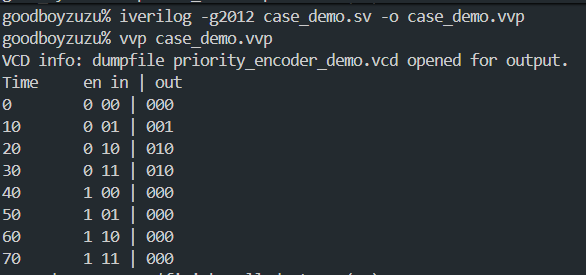
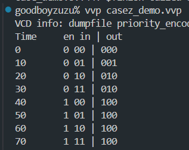

## case

## casez
- z and ? are treated as don't care values
- casex don't care about x, z, and ?. So it can be dangerous to use casex

## bad to use if else
- if, else if, ... uses priority encoding in 3.6.1. Cause delay
- case statement is better

In design practice, it is frequently desirable to have the item expressions
of a case statement meet the following conditions:
• all-inclusive: all possible binary values of the [case_expr] expression
are covered by the item expressions.
• mutually-exclusive: a binary value appears in only one item expression
(i.e., no overlapping binary value ).